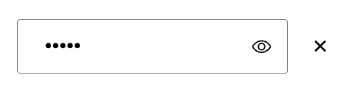
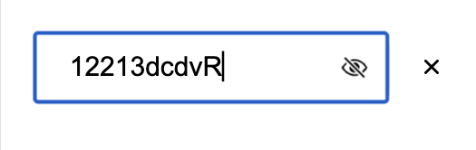
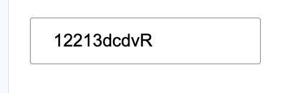
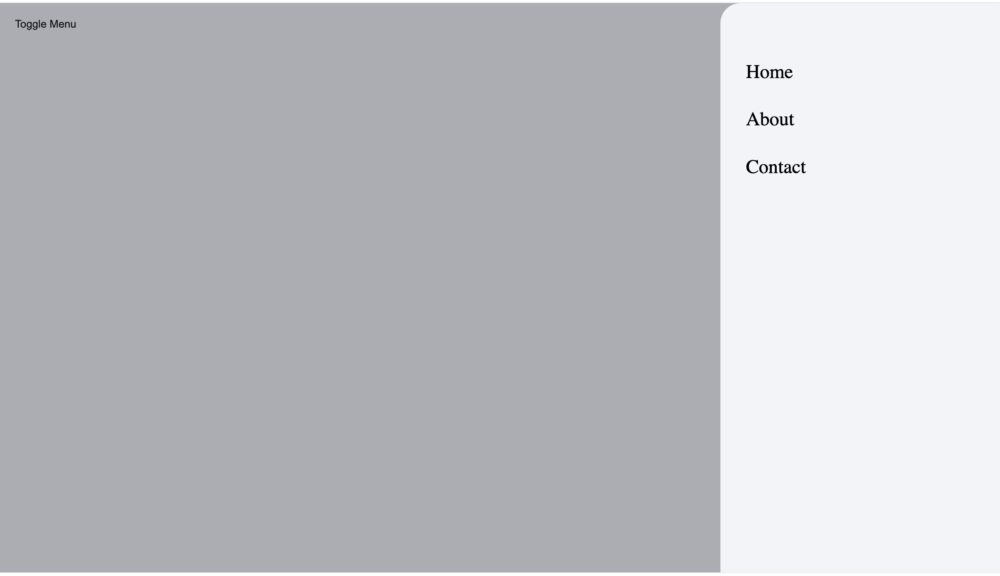
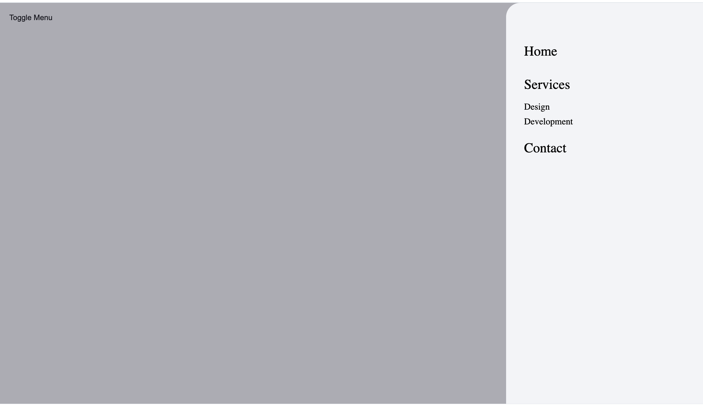
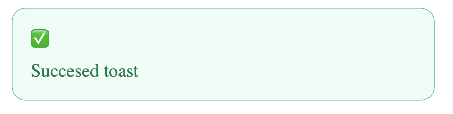
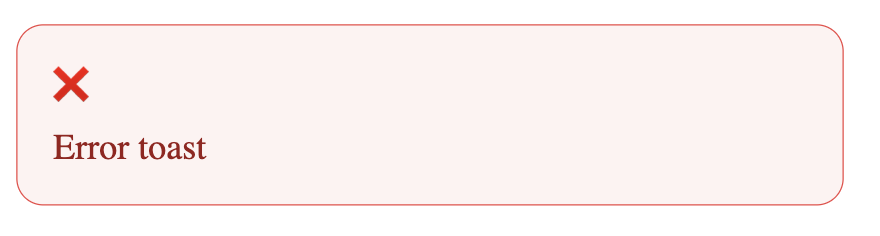
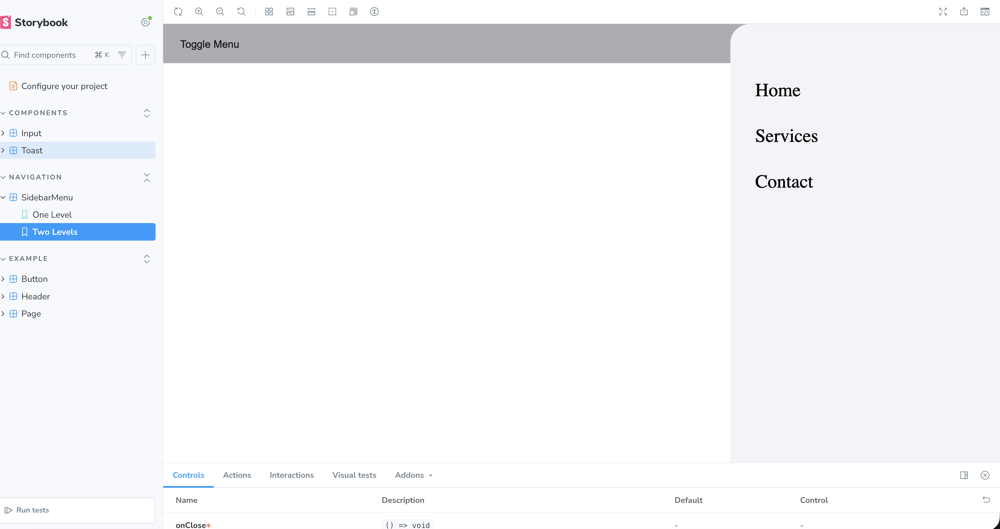

## 🛠️ Setup Instructions

Clone the repo:

```
git clone https://github.com/karenkarap/react-components-test.git
cd react-components-test
npm install
npm run storybook
```

## 🔹 Component Overview

### Input Component

- A universal input field supporting types: text, password, and number.
- For password, an eye icon toggles visibility.
- Can be clearable with a small close button to reset the value.

### Toast Component

- Appears in the bottom-right corner of the screen.
- Supports types: success, error, warning, info.
- Automatically disappears after a specified duration.
- Includes smooth fade-in animations.

### Sidebar Menu

- Slides in from the right side of the screen.
- Supports nested menu items (accordion).
- Closes when clicking on the background overlay.
- Can show 1-level and 2-level nested items.

## 🧩 Components Preview

## Input Component

### Password hidden with eye and clearable



### Password with eye and сlearable



### Input text without clearable



## Sidebar Component

### Simple sidebar



### Sidebar with 2-level nested items



## Toast Component

### Toast Success



### Toast Error



## Storybook Overview


